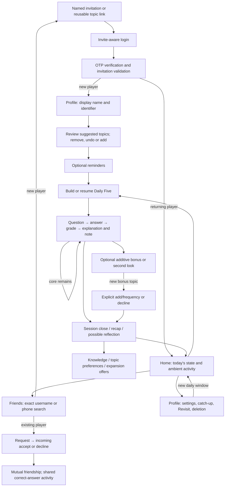

# Joshing: end-to-end product, gameplay and UX audit

2026-09-10 · Pre-implementation assessment. Evidence labels: **Observed** = this audit's browser; **Code** = current implementation; **Saved** = an earlier report, not a new measurement. Authenticated walkthrough remains pending safe test authentication. No historical PRD is treated as a current specification.

## Executive summary

Joshing has a coherent promise and a substantially coherent daily engine, but the seams still feel like separately designed features. The strongest idea is a small personal ritual that turns into shared knowledge. The largest experience problem is **semantic trust**: the words sometimes describe a different relationship, source, or progress state than the system actually implements.

The code distinguishes five core questions, optional generated friend-domain questions, and returning missed questions; it distinguishes an authored note from an editorial aside; it requires consent before adopting a new bonus topic. These are meaningful product strengths. Yet the Friends hub describes an accepted mutual friendship as a follow request, exact search can show an obsolete result after editing, daily status counts additive answers, and the topic badge still chooses a broad category ahead of a specific topic. Link suggestions can also be described as picked specifically for the recipient even when resolved from the inviter's interests.

This is primarily a cross-surface contract problem, not a need for a redesign or more social inventory. Five narrow changes are proposed below. Discovery policy, mastery rules, and navigation structure should remain unchanged.

## Methodology, instructions and limitations

- Initial working tree was clean. Read `CLAUDE.md`, `DECISIONS.md`, `PRODUCT-CANON.md`, current routes, components, helpers and tests. No root/ancestor or applicable `src` AGENTS.md was found; no edits to nested worktrees or salvaged code.
- Local app is already running at localhost:3000. Observed the signed-out login on desktop and at 390×844, plus the repository's explicitly write-stubbed onboarding replay. These are not authenticated gameplay observations.
- Local `.env`, `.env.local`, and shell checks did **not** establish the configured fixed test OTP/allowlist. No OTP was submitted, no SMS requested, no login bypassed and no authentication setting changed. Requested the safe configured environment from the owner. The login's acceptance-of-terms wording also requires browser-policy confirmation before sign-in.
- Scenarios A–G requiring authentication are **not yet executed**. In particular, the product owner search test has not run. There are no new database measurements, real grading observations, friend requests, invitations, or account creations in this audit at this point.
- Code tests and existing write-stubbed previews can support narrower findings; they cannot establish production configuration, actual question quality, cross-account consistency, live mobile behavior behind login, or next-day behavior.
- Saved evidence: `.reports/question-lifecycle-results.md` (September 9) records 9 recent builds, median 25.243s/p95 53.8202s and 91 grading calls, median about 1.014s. These are small, historical samples, not current measurements. They support investigating supply latency, not a fresh performance claim.

## What Joshing currently feels like

Observed entry has a distinctive illustrated identity and one clear phone action, but “Trivia you wish you were asked” does not yet explain the five-question ritual or conversational payoff. The write-stubbed setup introduces a daily game with friends, then calls the discoverable identifier a “call sign.” Code later calls it a “handle,” while friendship becomes “follow” in some screens. Learning is spread across Knowledge, recap, catch-up and Revisit, rather than a single implemented screen literally called Learning and Review.

The product is closest to its promise when a specific interest becomes a question, a real creator note is revealed, and a missed answer later sticks. It loses coherence when the player has to translate terminology or infer why a system-chosen item is attributed to a friend.

## Strongest parts

1. `daily/bonus.ts` centralizes core, bonus and return distinctions; `types.ts` fixes the target at five. Home outcomes are a five-item structure.
2. `CreatorNote.tsx` chooses human/editorial treatment by provenance and uses words as well as visual treatment. Human notes are not simply replaced with generated asides.
3. `/api/daily/preferences/adopt-bonus-domain` requires a positive frequency choice. “Not now” makes no adoption call. Knowledge adds also have explicit actions and undo paths.
4. Grader unavailability returns an unscored retry, not a wrong answer; queue/question identity checks protect against scoring a stale question. Exact answers, alternatives and dispute/recheck paths exist.
5. Friendship acceptance backfills recent correct answers rather than flooding a friend with authored inventory. Revisit is self-initiated and has reversible set-aside behavior, without due badges or streak pressure.
6. Search is deliberately exact, bounded and authenticated, with blocked-pair filtering, rather than a public browse directory.

## Implemented lifecycle

### Journey and state map

All API references are under `/api`. Authenticated routes use session checks; page routing adds JWT/onboarding gating in `src/proxy.ts`. “Telemetry” below describes code instrumentation, not verified event delivery.

| Stage | Entry / UI | Route, state and content dependencies | Recovery / next step / expected understanding |
|---|---|---|---|
| 1–3 Open and accept invite | `/invite/[token]`, `/u/[handle]/[token]`, `InvitationLanding`, invite-aware `LoginPanel` | `friendInvitations`, `inviteLinks`, `users`; named phone claim vs reusable link; accept-token and invite-links/accept | Invalid/expired/used named links have dedicated states; reusable link redirects signed-out players into login. User must understand who invited them and that topics are suggestions. |
| 4 Authenticate | `/login`, OTP UI | auth/request-otp, verify-otp; normalized phone, OTP bypass allowlist, User/Session; revalidate invitation before provisioning; invitation acceptance forms both follow edges | Errors remain in login; SMS delivery failure cannot be treated as successful production delivery; claims gate onboarding. A race after provisioning can leave an orphaned account: code explicitly acknowledges this. |
| 5 Choose topics | `/onboarding`, `OnboardingFlow` | Named preSeededInterests or joined link topics, catalog top-ups, AI answerability/canonicalization; account PATCH, account/handle, onboarding/save-interests | Non-catalog seeds start selected; remove/Undo, selection cap and minimum, explicit save. Link-source server comment saying “not preselected” is stale. |
| 6 Edit topics | Knowledge manage, daily/setup, shared AddTopicField | declared-interests, interests/check/expand, daily/preferences and domain-frequency; declared interests, frequency and mastery | Specificity suggestions, errors, undo/add/remove; user must distinguish interest preference from demonstrated knowledge. |
| 7–8 Home / today's five | `/`, daily Home card and Nav | daily/status; daily queue/date, preferences, five outcomes, bonus outcomes, reset boundary; activity stream and nav counts | Start/resume/completed states. Daily boundary is 17:00 UTC formatted locally. Missing queue reports target five; actual supply may gracefully degrade. |
| 9–13 Play / grade / explanation | `/daily`, `GameplayChat`, `AnswerInputBar`, `NotForMeSheet` | daily/queue, answer, skip, recheck; DailyQueue JSON slots, Question/GeneratedQuestion, grade metadata, mastery; generation and grading LLMs, stored explainer, async breadcrumb | Retry unscored answer, stale-slot reconciliation, skip/rest topic, explanation and creator/editorial note. User needs source, current question and next action. Server timing and grading telemetry exist. |
| 14–15 Completion / recap | session-close row, `/daily/summary`, FirstSessionPanel | daily/summary, daily-summary query; core completion selector, session totals, mastery gains, first-session state, optional ceremony redirect | Recap can represent partial session; rows distinguish additive questions. Multiple actions: share/save/report/refine, expansion, reminders and possible author invitation. User attention cost needs live validation. |
| 16–17 Optional questions/topics | bonus banner, geometric progress, adoption card | presence-source and return-scope markers; adopt-bonus-domain + frequency; mastery write deliberately avoids new bonus territory until consent | Separate bonus numbering; leave optional questions; explicit “Not now.” Generated bonus is from a friend's domain/activity, not a question they necessarily answered. |
| 18–19 Learning / Review / Solid | `/knowledge`, `/daily/catchup`, `/recovered`, ceremony | KnowledgeFlatClient; knowledge tree + mastery + preferences; catchup answers; recovered-questions reads and recovered/set-aside writes | Flat portrait is current; alternate maps remain retired code. Revisit is wrong-then-right deck, reveal/next with restore shelf. Solid belongs to mastery tiers, not a new due-task system. Comprehension needs actual longitudinal play. |
| 20 Find people | Friends Nav → `/friends`, FindFriendsSearch, contacts card | friends/search, friend-search query, relationship and blocks; contact hashes/privacy gate; markDiscoveryChecked on landing | Exact query, single result, pending/friend action states; loading/error/no-result. Debounce race and stale-copy defects detailed below. First-tap failure not observed. |
| 21 Requests | AddFriendRequestModal, AddFriendButton, FriendsList, Home FriendRequestsSection | friend-requests POST and [id]/accept, ignore, cancel, remove; Follow unique pair, activities, two approved edges on accept | Duplicate/self/blocked checks, decline cooldown, removal confirmation. Ignore actually declines rather than merely leaving pending. Local list refresh and Home router refresh differ. |
| 22 Invite new people | InviteLinksSection and named invitation flow | friend-invitations create/list/edit/cancel; persistent invite-links create/edit/delete; selected categories and join attribution | Copy/share can recover saved links; inviter can revisit persisted state. Invitation messages are prepared for user sharing, not automatic social SMS (campaign excludes invitations). |
| 23 Return | login → Home → existing queue/new boundary | session, queue date, persisted slots, reset helpers; on-demand supply and cron | Same-day resume reconstructs reveals; later-day window is derived from shared UTC cutoff. Actual return walkthrough outstanding. |
| 24 Settings | `/users/me`, account/reminders and privacy forms | reminder acquisition state, explicit SMS/email preference, contact/mutual/niche discoverability | Optional reminder decline allowed; failed opt-in should not consume acquisition state. Some copy says “afternoon” despite worldwide reset. |
| 25 Delete | Profile normal delete confirmation → account DELETE | deleteUserAccount transaction + destroySession; own data removed, retained players' mastery preserved through question tombstones; attribution anonymized | No direct DB deletion authorized or performed. Live account cleanup must use UI and be verified; no disposable account created yet. |

## Significant findings by journey stage

| ID / finding | Evidence and scenario | Principle / severity / reach | Root cause, recommendation, confidence / immediate scope |
|---|---|---|---|
| F1 Search can show the wrong query's result | **Code**, FindFriendsSearch: sequence increments only when runSearch starts; clearing/changing query or focus handoff does not invalidate pending response; no check after response.json. C/D/E/G | Trust, clear next step. High consequence, latency-dependent reach. An Add friend action can remain attached to a previous query. | Invalidate on every edit/reset, cancel debounce on explicit search, recheck after body parse, retire pending requests on unmount. High confidence; implement with delayed-response tests. |
| F2 Social vocabulary describes the wrong contract | **Code** FriendsList “Wants to follow you / Approve / Ignore / Follow Requests”; Home uses Accept/Decline; friendships.ts disables public auto-approve and accepts both edges. D/E | Warmth, clarity, safe decline. Medium, every incoming request. | Legacy follow surface survived mutual-friend policy. Align incoming request vocabulary and accessible names, preserve true legacy one-way statuses. Also standardize player-facing identifier to username in onboarding/search/settings paths. High; implement copy-only changes. |
| F3 Daily count includes additive answers | **Code** daily/status counts all answered slots before clamping to five, while outcome dots exclude additive slots. B/F | Daily Five is sacred. Medium, bonus/return or skipped-core sessions. | Inconsistent aggregation. Count only core answers for Daily status; preserve separate bonus outcomes and intentionally session-wide recap totals. High; implement route regression tests. |
| F4 Topic label hides specificity | **Code** slotCategoryLabel returns non-generic broad_category first; existing test expects History for Renaissance Florence. B/F | Personalization should feel intentional. Medium, specific topics under a named broad category. | Previous fix removed General Knowledge but left category-first ordering. Prefer actual non-generic slot domain; keep broad/category fallback for missing/generic domains. High; implement with counterexamples. |
| F5 Link suggestions imply recipient-specific intent | **Code** OnboardingFlow says inviter “picked these for you”; user-invite-token can resolve topics automatically from inviter frequency/declared interests. Shared InvitationLanding says “picked” for both invitation kinds. B | Honest provenance. High trust impact, fallback/reusable links. | Source metadata knows named vs link, but presentation discards it. Describe topics “from [inviter]'s invitation” for reusable links; retain explicit named-invite credit and label catalog ideas separately. High; implement without changing topic defaults or consent. |
| F6 Bonus/recovery copy overstates a friend's knowledge or feelings | **Code** bonusSourceLabel says “FROM … KNOWLEDGE” though source is territory/activity; returnRecoveryNote says “[author] would be glad.” B/F | Generated context never implies a friend's explicit knowledge/intent. Medium; relevant bonus/recovery. | Relational copy outruns provenance. Recommend domain/interest wording and factual recovery acknowledgement; defer broader provenance sweep beyond five changes. High code confidence; not a claim that generated content actually quoted a friend during this audit. |
| F7 Search throttling gives no useful recovery | **Code** API returns 429 + Retry-After, client says generic “Search failed. Try again.” C/D/E/G | Clear next step, attention proportional to value. Medium when limits reached. | Generic response handling plus debounced keystrokes/Enter duplication. Include specific wait guidance with F1; do not change limits. |
| F8 Adjacent social APIs fall back to raw phones | **Code** api/users, users/recent and friends hub use phoneNumber as fallback display name. D | Privacy and recognition. High consequence for nameless/legacy users, conditional reach. | Legacy identity fallback outside hardened search projection. Recommend scoped username/generic fallback review, no new real-name collection. High; deferred due five-change limit and affected consumer breadth. |
| F9 Discovery controls and protection are incomplete | **Code** process-local rate maps, exact phone path does not consult contact discoverability, no durable search audit in route. C/D | Find known people without directory/spam. High strategic importance; abuse exposure not actively tested. | Infrastructure and policy boundaries. Durable throttling, explicit explanation of exact lookup vs contact sync, privacy-preserving monitoring require owner prioritization. No discovery-default changes. |
| F10 Completion offers can compete with reflection | **Code** summary includes per-row actions, gains, refine, expansion, reminder exit intercept and potential author invitation/ceremony. B/F | Reflection and calm next step. Medium hypothesis, frequency unmeasured. | Independently gated features accumulate in one transition. Instrument combinations and observe five real sessions before reducing hierarchy. Medium; do not redesign now. |
| F11 Supply wait threatens first-session momentum | **Saved** prior report's build timings; **Code** loading moments and on-demand generation. B | Questions as gifts, clear next step. High strategic importance; current frequency unknown. | Supply readiness, verification and boot/network latency. Inspect fresh new-account critical path once test authentication is available. No unmeasured prompt/model changes. |
| F12 Replay is not fully isolated from availability checks | **Code** onboarding preview skips writes, but handle availability effect still fetches protected api/handle/check; proxy does not exempt that endpoint. **Observed** replay reachable signed-out. | Recoverable loading states. Low production reach, harms validation. | Preview/auth boundary mismatch; do not equate preview with signup E2E. Separate follow-up, not one of five production fixes. |

## Findings by principle

| Principle | Assessment |
|---|---|
| Conversation over competition; warmth | Real notes, shared correct answers and recovery have conversational potential. F2/F6 weaken the relationship's meaning. No evidence supports adding scores, rankings or rewards. |
| Questions as gifts; specificity | Provenance and topic defaults carry the gift; F4/F5 undermine the sense of deliberate choice. |
| Five is sacred | Strong shared selectors; F3 is a remaining reader inconsistency. Graceful supply shortfalls are distinct from intentionally enlarging the five. |
| Reflection; learning without schoolwork | Revisit is optional and restorative. Knowledge and recap vocabulary/metrics need live comprehension checks before redesigning Solid. |
| Honest provenance; no fabricated friend intent | CreatorNote is a strength; F5 confirmed, F6 warrants a fuller copy/content audit. |
| Ambient meaningful activity | Correct-answer backfill provides value even when few people author. Distinguish replaying something a friend answered from generated domain-based bonus. |
| Clear next step; proportional attention | Focused answer input works in code. F1/F7 impair recovery; summary attention budget remains an unproven concern. |
| Known-person discovery with privacy | Exact lookup supports this principle. F8/F9 are more important than making search broader. |
| Additional repository principles | Canon also forbids fake social density, protects recipient pace and privacy gates, values scarcity/specificity, and treats question quality as UX. Home “edition” and alternate-map descriptions are historically superseded; do not restore them. |

## Hypothesis disposition

“Resolved” means a code path already addresses the concern, not that this audit verified it live.

| Hypothesis | Status | Basis |
|---|---|---|
| Invitation unclear about inviter/purpose | Partially confirmed | Named landing identifies inviter; plain entry does not explain five; link provenance F5. Authenticated conversion unmeasured. |
| Suggested/self-added topic hierarchy wrong | Unsupported | Current picker shows seeds before Add your own, stable positions and Undo. Need live comprehension evidence. |
| Topic labels too broad | Confirmed | F4 and current unit expectation. |
| Bonus violates/blurs five | Partially confirmed | Selectors/numbering separate bonus; F3 status aggregation leaks additive answers. |
| Bonus topics automatically added | Resolved | Explicit adoption endpoint; Not now does not call it. |
| Generated context implies friend knowledge/intent | Partially confirmed | Link fallback “picked” and knowledge/feelings copy; no live generated text inspected. |
| Return-time copy inconsistent | Partially confirmed | Shared local boundary helpers coexist with “afternoon”; worldwide suitability unproven. |
| Recap too crowded | Unsupported | Multiple gates exist, but no observed combined recap. |
| Learning/Review feels like task management | Unsupported | Optional Revisit contradicts a simple task-queue characterization; Solid comprehension untested. |
| Discovery difficult/broader search risky | Partially confirmed | F1/F2/F7 create friction; broader search would materially increase exposure. |
| Information arrives at wrong moment | Partially confirmed | F1 stale search; summary timing concern unproven. |
| Automatic next step insufficiently explained | Unsupported | Code has optional ceremony/summary decisions; no live expectation evidence. |
| Mobile truncation, first-tap, synchronization defects | Partially confirmed | F1 confirmed by code; Home request note/topic uses truncate; first-tap failure not reproduced. |
| Invite acceptance and friendship disconnected | Resolved | Named/link acceptance implementations establish mutual follows; race/operational success unverified. |
| Phone and username inconsistent | Partially confirmed | Server supports exact normalized phone and case-insensitive username; result no-match wording says “name,” F1 affects both. |

## Finding and Friending People

Known people can be found by complete username (optional @, case-insensitive) or a complete US number. `friend-search.ts` normalizes phone punctuation/country code, uses exact equality or LOWER equality, limits to one row, excludes self and blocked pairs. The historic numeric-as-handle error has already been corrected by requiring an initial letter. No real-name collection is required to improve this experience.

Search returns id, username/internal handle, display name, avatar color, join timestamp and relationship. It does not return the phone. Display name and username are sufficient recognition signals when known, though duplicate names and legacy nameless accounts deserve testing. Join age is supplementary rather than proof of identity. Phone storage includes normalized plaintext for authentication/search plus salted SHA-256 contact hashes; this is not encrypted phone search. The hash salt is described in code as client-visible, so hashes do not make the small phone-number space intrinsically secret.

Search requires a session. Defaults cap at 8 account lookups/minute and 40 IP lookups/minute, per instance. Request sends cap at 20/day and 60/week per account, also per instance. Cold starts, multi-instance distribution, disabled/misconfigured limits and trusted-forwarding assumptions limit their strength. Exact match still confirms membership; repeated exact guesses remain an enumeration risk. No aggressive tests were performed. The availability endpoint claims to be public in a comment but current proxy protects it; do not infer a public directory from the comment.

Requests verify session, target existence, self, blocked relationship and pending/existing state. Acceptance/ignore/cancel/remove routes delegate actor-scoped operations; acceptance creates mutual approved edges. Decline retains a declined edge with a 30-day default re-request cooldown, hidden from the requester. Leaving a request untouched differs from invoking Ignore/Not now, which actually declines. Removal and blocking exist; contact/mutual/niche discoverability controls exist. Content reporting exists, but a complete people-harassment reporting workflow was not established. Request telemetry and activities exist; a durable privacy-preserving search-abuse log was not found in the searched route.

Invitations are different from requests: a named pending invitation is bound to a verified phone, while a reusable link is an invitation credential available to its bearer. Accepting either is intended to establish friendship; joined-link attribution selects the correct seed topics. Saved links/categories can be recovered by revisiting Friends. Live creation, recovery, used-link handling and both-account acceptance remain unverified.

Friendship enables direct questions, shared interests and recent correctly answered questions. It can have value even without prolific authors, because correct-answer activity is backfilled. That is meaningful conversational material, but activity counters alone are not conversation. Preserve source labels rather than simulating sender intent.

**Answers to the discovery decision:** improve reliability, terminology, recognition and state explanation first. Do not introduce fuzzy search, phone directories, public indexes, new discoverability defaults or real-name requirements. Owner decisions concern exact lookup's privacy contract, durable abuse protection, bearer-link sharing expectations, legacy phone fallbacks and person-reporting policy. The product owner search test remains not run; no owner's personal information appears here.

## Defects, experience problems and root causes

- Defects: F1 stale response, F3 aggregation mismatch; existing checks cover nearby logic but miss reader/transition edge cases.
- Content/usability: F2 inconsistent social contract, F4 broad labels, F5 unsupported personal intent, F7 opaque recovery.
- Privacy/abuse: F8 identity fallback, F9 distributed rate limits and unclear exact-lookup privacy semantics.
- AI quality: actual generated questions/grading quality not assessed live; F6 is deterministic copy around generated content, not proof of an LLM hallucination.
- Visual/accessibility: placeholder-only search input, no search live region, narrow flex result row and truncated request context need verification. Login mobile has an accessible input name. No full WCAG or contrast claim.
- Technical debt: repeated state projections, legacy follow vocabulary, stale source comments, separate local refresh patterns, preview calls leaking into auth-protected APIs.
- Policy/strategy: do not confuse already-ratified mutual friendship or topic consent with open discovery/review design questions.

## Ranked opportunities and recommended direction

| Rank | Opportunity | Impact / strategic importance | Effort | Confidence | Risk |
|---|---|---|---|---|---|
| 1 | Reliable exact-search state and recovery (F1/F7) | High / high | Small | High | Low |
| 2 | Honest source wording for link topics (F5) | High / high | Small | High | Low |
| 3 | Align friendship and username vocabulary (F2) | Medium / high | Small | High | Low |
| 4 | Core-only Daily status (F3) | Medium / high | Small | High | Low |
| 5 | Specific question topic labels (F4) | Medium / high | Small | High | Low |
| 6 | Eliminate phone identity fallbacks (F8) | High / high | Medium, wider consumer review | High | Medium |
| 7 | Durable abuse controls and explicit discovery contract (F9) | High / high | Medium–large | High code evidence | Policy-dependent |
| 8 | Fresh first-session latency and recap study (F10/F11) | High / high | Medium | Medium | Low investigation risk |

Direction: **one ritual, clear sources, explicit relationships**. Each transition should preserve what “five,” “friend,” “topic,” and “from” mean. Let the honest sparse social experience work before adding activity volume. Explain consequences at the choice, not through a tutorial about internal models.

## Immediate implementation proposal (five changes maximum)

1. Repair exact search lifecycle, deduplicate Enter/debounce, make rate-limit recovery useful, and label/announce its UI.
2. Align incoming request/identifier vocabulary across affected current surfaces, without changing friendship policy or true legacy one-way states.
3. Count only core answers in Daily status; leave session recap totals explicitly session-wide.
4. Prefer the actual specific question domain in the topic badge.
5. Remove recipient-specific choice claims from reusable-link topic provenance; preserve named-invite authorship and topic consent/defaults.

## Owner decisions and verification/rollback plan

Owner judgment remains required for search/discoverability policy, durable rate limiting, person reporting/blocking expectations, bearer-link scope, recap prioritization, Solid/learning model changes, and any broad generated-context framing redesign. No deployment, migration or production content mutation is proposed.

Before/after: capture real write-stubbed preview or explicitly labeled synthetic component fixtures where authentication is unavailable; never label these as live account walkthroughs. Add meaningful delayed-response tests, route tests for core/bonus/return counting, source-copy/label tests and relevant existing social tests. Run type check, lint, full unit/integration suite and production build; record exact failures and environmental limits. Repeat affected UI paths at desktop/mobile where accessible, verify focus and neighbor states. Revert the five file groups to roll back; no data migration. Preserve all unrelated work. Once safe test auth is confirmed, finish A–G, capture pending request before accepting, remove disposable friendship through UI and delete only the newly created test account through normal UI.

## Screenshot evidence

- [Login, desktop](end-to-end-gameplay-ux-screenshots/01-login-desktop.png) — observed signed-out local app; no entered identifiers.
- [Login, mobile](end-to-end-gameplay-ux-screenshots/02-login-mobile.png) — 390×844; same limitation.
- Additional preview and before/after evidence will be indexed in the results report with explicit provenance.

No test accounts, invitations, friendships, or personal data were changed before this report was written.
