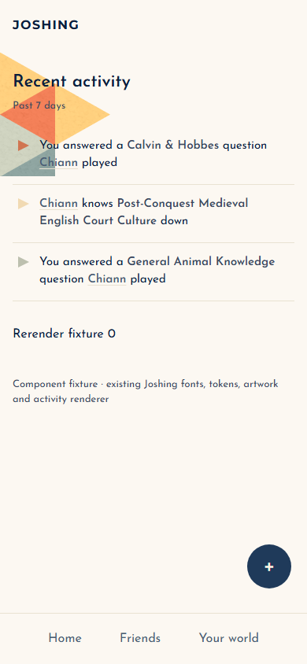
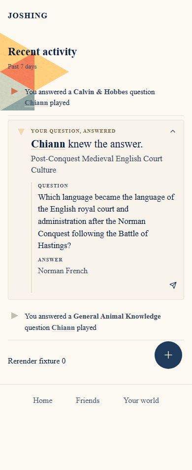

# Recent Activity: authored questions answered

Home now highlights verified correct responses to questions the viewer personally wrote. The card starts expanded and leads with “YOUR QUESTION, ANSWERED” and “[display name] knew the answer.” The category, editorial serif question, and canonical answer follow. Light mode uses parchment; the dark card uses Joshing's existing navy (#1f3a5a), as requested. The existing send affordance remains available.

Canonical authorship is explicit. Correct `they_got_you` moments qualify through the existing query; author-side niche matches require the canonical question creator to match the viewer. Forwarded questions, incorrect responses, and raw friend-answer copy do not establish eligibility. Privacy, scoring, ordering, and event identity/read handling remain unchanged. Routine rows and the dedicated Activities page retain their existing defaults. The existing expansion state preserves a user's collapse through ordinary rerenders.

## Before and after

Screenshots use production components, existing fonts/tokens, and synthetic activity data in a browser fixture. Unrelated child flows are stubbed. Artwork and fixed navigation/FAB positioning are illustrative; these are not authenticated Home screenshots.

| Before | After |
| --- | --- |
|  |  |

- [Before, manually expanded](before-mobile-expanded.png)
- [Expanded featured card](after-mobile-featured.png)
- [Long name, category, and question at 375px](after-mobile-long.png)
- [Long card scrolled clear of fixed controls](after-mobile-long-scrolled.png)
- [Collapsed featured card](after-mobile-collapsed.png)
- [Desktop](after-desktop.png)
- [Navy dark card](after-desktop-dark.png)

## Files changed

| File | Purpose |
| --- | --- |
| `src/lib/activity-stream.ts` | Explicit verified authored-answer metadata and safe display-name fallback. |
| `src/server/db/queries/activity.ts` | Canonical creator identity in the existing niche-match question batch. |
| `src/components/FeedList.tsx` | Enable the treatment on Home, excluding pending overflow. |
| `src/components/activity/ActivityStreamItem.tsx` | Card hierarchy, default expansion, Question label, ARIA controls, and nested-link keyboard handling. |
| `src/app/globals.css` | Local parchment/navy theme and accessible foreground tokens. |
| `src/components/activity/__tests__/FeaturedAuthoredAnswer.test.tsx` | Rendering/classification, missing-data, long-content, and shared-screen regressions. |
| `src/server/db/queries/__tests__/activity-authored-answer.test.ts` | Actual hydration coverage for canonical authorship, forwards, creator-less questions, IDs/read flags, and batch reuse. |
| `src/server/db/queries/__tests__/lately-moments-blocked.test.ts` | Real query predicate coverage for correct, incorrect, forwarded, self-answer, and credit-only records. |
| This report, screenshots, and `browser-results.json` | Review evidence and verification limits. |

## Verification on the PR branch

- Focused Vitest suite: **22 files, 123 tests passed**.
- `npx tsc -p tsconfig.typecheck.json --incremental false`: **passed** in the clean checkout.
- `npm run lint`: **passed**, 0 errors and 48 existing warnings.
- `check:colors`, `check:fonts`, `check:radius`, `check:spacing`, `check:design`: **passed**.
- Chromium at 375px, 390px, and desktop: initial expansion; click/Enter/Space collapse; collapse persistence after rerender; profile link navigation; existing send menu/Escape; long text without horizontal overflow; 44px targets; ARIA state/control association; reduced motion; scroll access around fixed controls: **passed**.
- Featured text contrast exceeds **4.5:1** in light and forced-dark navy treatments.
- Browser runtime errors: **none**. Rendering the cards makes **no API requests**. Opening the existing send menu performs its existing on-demand invite-link request.
- [Detailed browser measurements](browser-results.json)

The focused command was:

```text
npx vitest run src/components/activity/__tests__ src/lib/__tests__/activity-stream-group3.test.ts src/server/activity/__tests__ src/server/db/queries/__tests__/lately-moments-blocked.test.ts src/server/db/queries/__tests__/activity-authored-answer.test.ts src/app/activities/__tests__ src/server/home/__tests__/select-edition.test.ts
```

## Limits and follow-up

Authenticated live Home, native screen-reader speech, and physical iPhone/Safari were not exercised. Forced-dark checks apply to this card, not the entire application. Missing canonical answers do not invent an answer or reveal a player's submission; missing question text retains the compact fallback. Collapse persistence lasts while the component remains mounted.

Related responses remain independent events. Grouping several friends by canonical question is a separate enhancement requiring a decision about chronological placement and preservation of each member's read state. No migration, dependency, artwork change, or unrelated local work is included.
